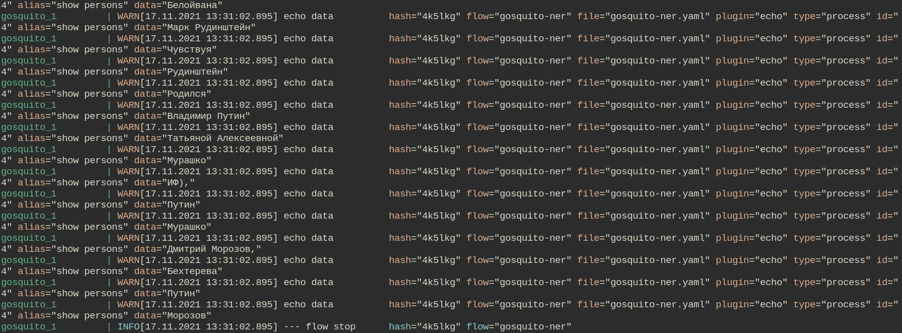

#### Description:

Connect [digator-opennlp](https://github.com/livelace/digator-opennlp) backend to [label-studio](https://labelstud.io/) for automatic NER labeling.

#### Quick start:

1. Run environment:
```shell
git clone https://github.com/livelace/digator /tmp/digator
cd /tmp/digator/examples/gosquito-ner
docker-compose up
```

2. See extracted entities in console output.
<br><br>
