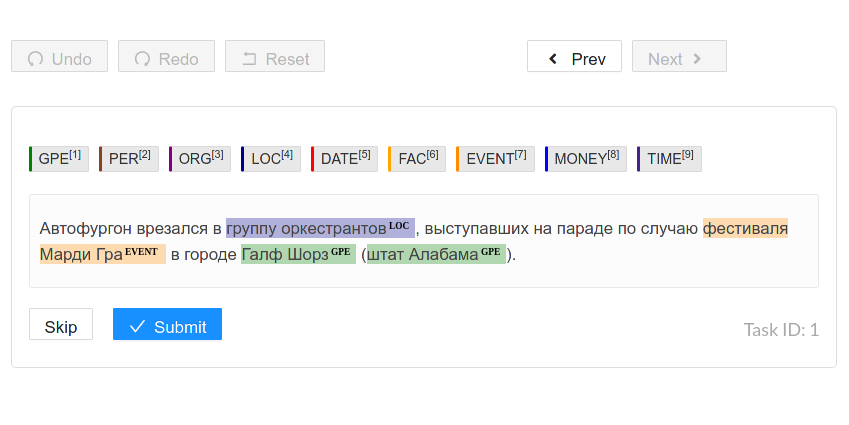

#### Description:

Connect [digator-opennlp](https://github.com/livelace/digator-opennlp) backend to [label-studio](https://labelstud.io/) for automatic NER labeling.

#### Quick start:

1. Run environment:
```shell
git clone https://github.com/livelace/digator /tmp/digator
cd /tmp/digator/examples/label-studio-ner
docker-compose up
```

2. Navigate to [http://127.0.0.1:9090](http://127.0.0.1:9090) for data labeling.
<br><br>
